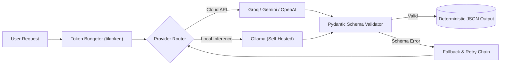

# Generative AI & Agentic Systems Engineering Lab

[](https://github.com/lowkey999-netizen/genai-course-work/actions/workflows/ci.yml)


An applied engineering repository exploring the mechanics of Large Language Models, high-dimensional vector spaces, provider routing, and autonomous agent architectures—built from first principles with automated CI verification.

---

## Architecture Overview



---

## Engineering Focus

Rather than treating AI models as black boxes or writing brittle prompt scripts, this repository is a technical lab focused on:

- **Foundational Mechanics:** Understanding context economics, token serialization (BPE), and high-dimensional vector geometry before making API calls.
- **Provider & Model Diversity:** Architecting unified interfaces across cloud providers (Gemini, Groq, OpenAI) and local inference engines (Ollama).
- **Deterministic Reliability:** Constraining probabilistic models into strict, machine-readable schemas using Pydantic, JSON Schema, and structured tool calling.
- **Test-Driven AI Development:** Every concept is backed by unit tests and offline mock fixtures, verified automatically via GitHub Actions CI.

---

## Core Concepts & Implemented Modules

| Module / Session                           | Core Technical Focus                                                            | Key Implementations & Artifacts                                                                                            | Test Suite          |
| :----------------------------------------- | :------------------------------------------------------------------------------ | :------------------------------------------------------------------------------------------------------------------------- | :------------------ |
| **Session 09b: Tokens & Embeddings**       | BPE tokenization, context budgeting, token-to-byte ratios, pricing estimation   | [`s09_tokens.ipynb`](module01/s09_tokens.ipynb)<br>• [`tokens_utils.py`](module01/tokens_utils.py)                         | `tests/test_s09.py` |
| **Session 10: Model Landscape**            | Model comparison matrix, throughput/latency benchmarks, capability tiers        | [`s10_model_matrix.ipynb`](module01/s10_model_matrix.ipynb)<br>• [`landscape_utils.py`](module01/landscape_utils.py)       | `tests/test_s10.py` |
| **Session 11: Multi-Provider Routing**     | Unified provider interfaces, temperature sweeps, fallback chains                | [`s11_providers.ipynb`](module01/s11_providers.ipynb)<br>• [`providers_utils.py`](module01/providers_utils.py)             | `tests/test_s11.py` |
| **Session 12: Local Models**               | Self-hosted inference via Ollama, latency benchmarks, edge deployment tradeoffs | [`s12_local_models.ipynb`](module01/s12_local_models.ipynb)<br>• [`local_models_utils.py`](module01/local_models_utils.py) | `tests/test_s12.py` |
| **Session 13: Vision & Structured Output** | Multimodal OCR, ID card / document parsing, strict Pydantic extraction          | [`s13_vision_structured.ipynb`](module01/s13_vision_structured.ipynb)<br>• [`vision_utils.py`](module01/vision_utils.py)   | `tests/test_s13.py` |

---

## Key Engineering Takeaways

- **Vector Geometry & High Dimensions:** In 1536-dimensional embedding spaces, Euclidean distance suffers from distance concentration (the curse of dimensionality). Cosine similarity normalizes vector magnitude, capturing pure semantic orientation and direction.
- **Context Window Economics:** Pre-computing Byte Pair Encoding (BPE) counts locally prevents silent prompt truncation, mitigates context drift, and enforces strict operational cost budgets.
- **Deterministic Output Guarantees:** Unconstrained LLM outputs inevitably break downstream systems. Enforcing Pydantic models with constrained regex patterns and enum types turns unstructured text into machine-readable JSON contracts.
- **Hybrid Cloud vs. Local Routing:** Cloud endpoints offer scale and frontier intelligence, while local Ollama instances guarantee data privacy and zero inference costs. Routing dynamically based on task sensitivity balances performance and budget.

---

## Interactive Browser Visualizers

To build intuition for the underlying mathematics, standalone HTML tools run entirely client-side in the browser:

- **[Complete Embedding & SVD Pipeline Visualizer](https://raw.githack.com/lowkey999-netizen/genai-course-work/main/module01/pipeline_visualizer.html)**  
  _Interactive trace: `Word → Vector Sliders → 768D Space → PCA Shadow → SVD Engine → 2D Projection`._
- **[Interactive Embedding & PCA Journey](https://raw.githack.com/lowkey999-netizen/genai-course-work/main/module01/interactive_embedding_pca_journey.html)**  
  _Visual explanation of how dimensionality reduction flattens high-dimensional semantic clouds._
- **[Embeddings & Dimensions Sliders Visualizer](https://raw.githack.com/lowkey999-netizen/genai-course-work/main/module01/embeddings_visualizer.html)**  
  _Interactive exploration of cosine similarity angles and coordinate sliders._

_(Explore the full visual guide and datasets in [`module01/README.md`](module01/README.md).)_

---

## Architecture & Engineering Practices

- **Automated CI (GitHub Actions):** Every commit triggers an automated pipeline running **65+ unit and logic tests** offline, ensuring business logic and schema parsers never regress.
- **Modern Python Toolchain:** Managed via [`uv`](https://docs.astral.sh/uv/) for fast virtual environment resolution and deterministic dependency locking.
- **Upstream Sync Architecture:** Employs a dual-branch Git pattern (`main` vs `upstream-sync`), keeping personal portfolio engineering and upstream syllabus updates cleanly decoupled.

---

## Quickstart

### Prerequisites

- Python 3.12+
- [`uv`](https://docs.astral.sh/uv/) installed

### 1. Clone & Sync Environment

```bash
git clone https://github.com/lowkey999-netizen/genai-course-work.git
cd genai-course-work
uv sync
```

### 2. Run the Offline Test Suite

Run the verified offline test suite instantly without needing API keys or incurring costs:

```bash
uv run pytest tests/ showcase/ --ignore=tests/test_setup.py -k "not live and not estimate_matches and not test_model_answers" -v
```

### 3. Run Live Provider Tests (Optional)

To run live integration tests against real models:

```bash
# Copy template and add your API keys (Ollama, Gemini, Groq, or OpenAI)
cp .env.example .env
uv run pytest
```
