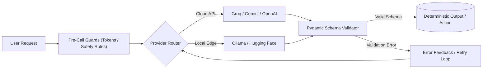

# Generative AI & Agentic Systems Engineering Lab

[](https://github.com/lowkey999-netizen/genai-course-work/actions/workflows/ci.yml)


> _Built while following Ajit Byru's GenAI / Agentic AI course._

An applied engineering repository exploring the mechanics of Large Language Models, high-dimensional vector spaces, provider routing, and working toward agentic workflows with automated CI testing and strict schema enforcement.

---

## System Architecture



---

## Showcase Applications

Canonical reference workflows from the course demonstrating code-owned execution sequences where language models handle unstructured parsing and intent extraction:

- **[Automated Insurance Claim Intake](showcase/a2_insurance/README.md) (`showcase/a2_insurance`):** Parses free-text vehicle damage claims into validated structured forms (`ClaimForm`), routing claims by severity to automated fast-track payout or human adjuster queues.
- **[Healthcare Clinic Booking Flow](showcase/a3_healthcare/README.md) (`showcase/a3_healthcare`):** Multi-step patient conversational intake featuring pre-model emergency safety guards, model-based intent routing, dynamic slot-filling, and deterministic appointment scheduling.

---

## Modules Overview

| Module                                           | Core Technical Focus                                                                                                                                      | Status      | Documentation                           |
| :----------------------------------------------- | :-------------------------------------------------------------------------------------------------------------------------------------------------------- | :---------- | :-------------------------------------- |
| **Module 01: Foundations & The Model Landscape** | BPE tokenization, vector embeddings, dimensionality reduction (PCA/SVD), multi-provider routing, local quantization, and multimodal structured extraction | Completed   | [Explore Module 01](module01/README.md) |
| **Module 02: Prompt Engineering & Reasoning**    | Production prompt design, structural delimiters, private scratchpads, versioned prompt libraries, and reasoning cost/accuracy benchmarks                  | In Progress | [Explore Module 02](module02/README.md) |

---

## Core Engineering Takeaways

- **Module 01 (Foundations & The Model Landscape):** Pre-computing BPE token allocations and vector dimensions locally exposes hidden cost and latency trade-offs before making API calls. While hosted accelerators provide high throughput, local quantization (int4) and self-hosted models offer strict data residency when handling sensitive records. _(See detailed session benchmarks and visualizers in [Module 01](module01/README.md).)_
- **Module 02 (Prompt Engineering & Reasoning):** Unstructured natural language prompts fail under production constraints, requiring explicit delimiters and structural length boundaries. Moving static policies into system instructions unlocks prompt caching for significant cost savings, while intermediate reasoning must be isolated behind private scratchpads to protect sensitive data. _(See prompt library and strategy benchmarks in [Module 02](module02/README.md).)_

---

## Engineering Practices

- **Automated CI (GitHub Actions):** Every commit triggers an automated pipeline running offline unit and logic tests across mock fixtures, preventing schema regressions and logic bugs without incurring API token costs.
- **Fast, Deterministic Environments:** Managed with [`uv`](https://docs.astral.sh/uv/) for rapid virtual environment resolution and exact cross-platform dependency locking via `uv.lock`.
- **Dual-Branch Upstream Architecture:** Employs an isolated two-branch Git strategy (`main` for personal engineering and documentation, `upstream-sync` as an untouched mirror for pulling course curriculum updates).

---

## Quickstart

### Prerequisites

- Python 3.12+
- [`uv`](https://docs.astral.sh/uv/) installed

### 1. Clone & Sync Environment

```bash
git clone https://github.com/lowkey999-netizen/genai-course-work.git
cd genai-course-work
uv sync
```

### 2. Run the Offline Test Suite

Run all verified offline unit and schema tests without needing API keys or incurring token costs:

```bash
uv run pytest tests/ showcase/ --ignore=tests/test_setup.py -k "not live and not estimate_matches and not test_model_answers" -v
```

### 3. Run with Live Providers (Optional)

To run live integration tests or launch notebooks against cloud and local models:

```bash
# Copy template and add your API keys (Groq, Gemini, or Ollama)
cp .env.example .env
uv run pytest
```
