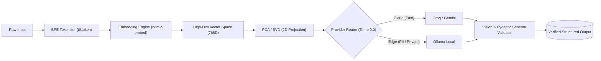

# Module 01: Foundations & The Model Landscape

> _Built while following Ajit Byru's GenAI / Agentic AI course._

This module explores the core mechanics and economics of Large Language Models: byte-pair tokenization, high-dimensional vector embeddings, dimensionality reduction (PCA/SVD), multi-provider routing, local quantization, and multimodal structured extraction.

---

## Module Pipeline Architecture



---

## Session Directory & Artifacts

| Session                                         | Core Lab Notebook                                              | Key Helpers & Data                                                                                                                                       | Concept Docs & Terms                                                                           | Test Suite                                  |
| :---------------------------------------------- | :------------------------------------------------------------- | :------------------------------------------------------------------------------------------------------------------------------------------------------- | :--------------------------------------------------------------------------------------------- | :------------------------------------------ |
| **Session 09b: Tokens & Embeddings**            | [`s09_tokens.ipynb`](./s09_tokens.ipynb)                       | • [`tokens_utils.py`](./tokens_utils.py)<br>• [`embeddings_10words.json`](./embeddings_10words.json)                                                     | • [`reading_tokens.md`](./reading_tokens.md)<br>• [`terms_s09.md`](./terms_s09.md)             | [`tests/test_s09.py`](../tests/test_s09.py) |
| **Session 10: The Model Landscape**             | [`s10_model_matrix.ipynb`](./s10_model_matrix.ipynb)           | • [`landscape_utils.py`](./landscape_utils.py)<br>• [`models_catalog.json`](./models_catalog.json)<br>• [`s10_matrix_output.md`](./s10_matrix_output.md) | • [`reading_landscape.md`](./reading_landscape.md)<br>• [`terms_s10.md`](./terms_s10.md)       | [`tests/test_s10.py`](../tests/test_s10.py) |
| **Session 11: Multi-Provider Calls & Sampling** | [`s11_providers.ipynb`](./s11_providers.ipynb)                 | • [`providers_utils.py`](./providers_utils.py)<br>• [`tickets_data.py`](./tickets_data.py)                                                               | • [`reading_providers.md`](./reading_providers.md)<br>• [`terms_s11.md`](./terms_s11.md)       | [`tests/test_s11.py`](../tests/test_s11.py) |
| **Session 12: Local & Open Models**             | [`s12_local_models.ipynb`](./s12_local_models.ipynb)           | • [`local_models_utils.py`](./local_models_utils.py)<br>• [`local_models_catalog.json`](./local_models_catalog.json)                                     | • [`reading_local_models.md`](./reading_local_models.md)<br>• [`terms_s12.md`](./terms_s12.md) | [`tests/test_s12.py`](../tests/test_s12.py) |
| **Session 13: Vision & Structured Output**      | [`s13_vision_structured.ipynb`](./s13_vision_structured.ipynb) | • [`vision_utils.py`](./vision_utils.py)<br>• [`sample_docs/`](./sample_docs/) (Synthetic KYC IDs & Bills)                                               | • [`reading_structured.md`](./reading_structured.md)<br>• [`terms_s13.md`](./terms_s13.md)     | [`tests/test_s13.py`](../tests/test_s13.py) |

---

## What I Learned

- **Session 09b (Tokenization):** In my BPE tokenizer benchmark, an identical loan query required 25 tokens in Telugu compared to 16 tokens in English. This roughly 56% increase in tokens demonstrates how non-Latin scripts suffer from sub-word fragmentation and carry higher operational costs.
- **Session 10 (Model Selection):** In the loan calculation benchmark, hosted Groq generated 489.2 tokens per second compared to local Ollama at 13.0 tokens per second. Despite this performance gap, strict data-residency compliance for sensitive loan records made self-hosted models the required deployment choice.
- **Session 11 (Temperature Stability):** In the ticket routing sweep, labels remained completely stable at temperatures 0.0 and 0.3, with drift only appearing at temperature 0.7 on borderline tickets. Setting temperature to 0.0 reliably suppresses this sampling variance and prioritizes the top logit for classification tasks.
- **Session 12 (Local Inference):** In the streaming benchmark, local Ollama took 11.14 seconds of total response time compared to 1.04 seconds on Groq. This roughly 11x total response time gap shows that while consumer laptops can handle asynchronous batch jobs, real-time user-facing features require hosted acceleration.
- **Session 13 (Structured Extraction):** While schema enforcement achieved valid JSON shape across all 5 test runs, it could not verify domain logic on its own. Layering a Pydantic validator resolved this by enforcing business rules, such as requiring a birth date for ID cards while allowing it to remain empty for utility bills.

---

## Interactive Browser Visualizers

To build geometric intuition for high-dimensional vectors and dimensionality reduction, this module includes three client-side HTML visualizers:

- **[Complete Embedding & SVD Pipeline Visualizer](https://raw.githack.com/lowkey999-netizen/genai-course-work/main/module01/pipeline_visualizer.html)** ([Architecture Notes](./Pipeline_visualizer_explanation.md))  
  _Walks step-by-step through the pipeline: `Word → Vector Sliders → 768D Space → PCA Shadow → SVD Engine (Rotate/Stretch/Rotate) → 2D Matplotlib Plot`._
- **[Interactive Embedding & PCA Journey](https://raw.githack.com/lowkey999-netizen/genai-course-work/main/module01/interactive_embedding_pca_journey.html)**  
  _Visual exploration of how dimensionality reduction flattens high-dimensional semantic clouds._
- **[Embeddings & Dimensions Sliders Visualizer](https://raw.githack.com/lowkey999-netizen/genai-course-work/main/module01/embeddings_visualizer.html)**  
  _Interactive slider tool showing how words translate to coordinate angles and cosine similarity._

---

## Running Module 01 Tests

Verify all module checkpoints offline:

```bash
# Run all deterministic offline tests across Module 01:
uv run pytest tests/test_s09.py tests/test_s10.py tests/test_s11.py tests/test_s12.py tests/test_s13.py -k "not live" -v
```
