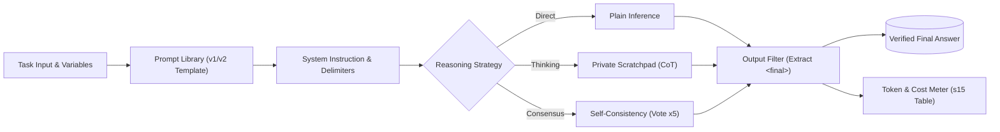

# Module 02: Prompt Engineering & Reasoning

> _Built while following Ajit Byru's GenAI / Agentic AI course._

An ongoing module exploring production prompt design, system instructions, and reasoning strategies. Work here focuses on versioned prompt libraries, structural delimiters, private scratchpads, and measuring the real token and latency costs of model reasoning.

## Module Pipeline Architecture



## Session Directory & Artifacts

| Session                                 | Core Lab Notebook                                        | Key Helpers & Resources                                                                                                                    | Deliverables & Artifacts                                                                                        | Test Suite                                  |
| :-------------------------------------- | :------------------------------------------------------- | :----------------------------------------------------------------------------------------------------------------------------------------- | :-------------------------------------------------------------------------------------------------------------- | :------------------------------------------ |
| **Session 14: Prompt Anatomy**          | [`s14_prompt_anatomy.ipynb`](./s14_prompt_anatomy.ipynb) | • [`reading_prompt_anatomy.md`](./reading_prompt_anatomy.md)<br>• [`terms_s14.md`](./terms_s14.md)                                         | • [`prompts/library.md`](../prompts/library.md) (v1 prompt library)                                             | [`tests/test_s14.py`](../tests/test_s14.py) |
| **Session 15: Reasoning Architectures** | [`s15_reasoning.ipynb`](./s15_reasoning.ipynb)           | • [`reasoning_utils.py`](./reasoning_utils.py)<br>• [`reading_reasoning.md`](./reading_reasoning.md)<br>• [`terms_s15.md`](./terms_s15.md) | • `experiments/s15_accuracy_table.md`<br>• [`prompts/library.md`](../prompts/library.md) (v2 reasoning entries) | [`tests/test_s15.py`](../tests/test_s15.py) |

## What I Learned

- **Session 14 (Prompt Anatomy):** An unconstrained prompt exceeded a 40-word limit by generating 97 words until explicit structural length constraints were added to the prompt anatomy. Moving static policy rules into the system instruction also enabled prompt caching, cutting repeated input costs by up to 50%.
- **Session 15 (Reasoning Architectures):** _In progress (benchmarking reasoning strategies and cost trade-offs)._

## Running Module 02 Tests

Verify all module checkpoints offline:

```bash
uv run pytest tests/test_s14.py tests/test_s15.py -v
```
