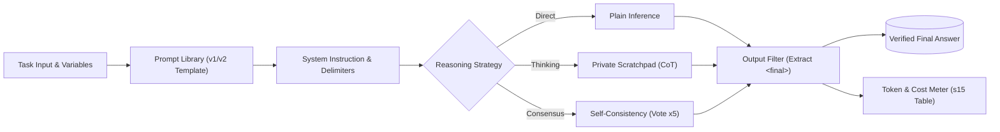

# Module 02: Prompt Engineering & Reasoning

> _Built while following Ajit Byru's GenAI / Agentic AI course._

An ongoing module exploring production prompt design, system instructions, and reasoning strategies. Work here focuses on versioned prompt libraries, structural delimiters, private scratchpads, and measuring the real token and latency costs of model reasoning.

## Module Pipeline Architecture



## Session Directory & Artifacts

| Session                                 | Core Lab Notebook                                        | Key Helpers & Resources                                                                                                                        | Deliverables & Artifacts                                                                                                                                                                                                                  | Test Suite                                  |
| :-------------------------------------- | :------------------------------------------------------- | :--------------------------------------------------------------------------------------------------------------------------------------------- | :---------------------------------------------------------------------------------------------------------------------------------------------------------------------------------------------------------------------------------------- | :------------------------------------------ |
| **Session 14: Prompt Anatomy**          | [`s14_prompt_anatomy.ipynb`](./s14_prompt_anatomy.ipynb) | • [`prompt_utils.py`](./prompt_utils.py)<br>• [`reading_prompt_anatomy.md`](./reading_prompt_anatomy.md)<br>• [`terms_s14.md`](./terms_s14.md) | • [`prompts/library.md`](../prompts/library.md) (v1 prompt library)                                                                                                                                                                       | [`tests/test_s14.py`](../tests/test_s14.py) |
| **Session 15: Reasoning Architectures** | [`s15_reasoning.ipynb`](./s15_reasoning.ipynb)           | • [`reasoning_utils.py`](./reasoning_utils.py)<br>• [`reading_reasoning.md`](./reading_reasoning.md)<br>• [`terms_s15.md`](./terms_s15.md)     | • [`experiments/s15_accuracy_table.md`](../experiments/s15_accuracy_table.md)<br>• [`prompts/library.md`](../prompts/library.md) (v2 reasoning entries)                                                                                   | [`tests/test_s15.py`](../tests/test_s15.py) |
| **Session 16: Structured Prompting**    | [`s16_structured.ipynb`](./s16_structured.ipynb)         | • [`structured_utils.py`](./structured_utils.py)<br>• [`reading_structured.md`](./reading_structured.md)<br>• [`terms_s16.md`](./terms_s16.md) | • [`prompts/support_classifier/system.md`](../prompts/support_classifier/system.md)<br>• [`prompts/support_classifier/user.j2`](../prompts/support_classifier/user.j2)<br>• [`experiments/s16_heldout.md`](../experiments/s16_heldout.md) | [`tests/test_s16.py`](../tests/test_s16.py) |

## What I Learned

- **Session 14 (Prompt Anatomy):** An unconstrained prompt exceeded a 40-word limit by generating 97 words until explicit structural length constraints were added to the prompt anatomy. Moving static policy rules into the system instruction also enabled prompt caching, cutting repeated input costs by up to 50%.
- **Session 15 (Reasoning Architectures):** Benchmarked Plain, Chain-of-Thought (CoT), Step-Back, and 5-way Self-Consistency across 10 deterministic loan-eligibility edge cases. On native reasoning models (`gpt-oss-20b`), asking for CoT achieved identical 10/10 accuracy while increasing token costs by ~88% ($0.09 vs $0.17 / 1k calls). Conversely, on local non-reasoning models (`qwen2.5:7b`), CoT was essential, flipping accuracy from 0/5 to 5/5. Implemented the `<scratchpad>` curtain to prevent sensitive internal risk metrics from leaking into customer-facing outputs.
- **Session 16 (Structured Prompting):** Engineered a decoupled support ticket classifier isolating raw data inside `<ticket>` delimiters to block instruction injection and tag breakouts (`escape_tags`). Configured Jinja2 templates with `StrictUndefined` to guarantee loud failures on missing variables. Migrated system instructions into a versioned, SHA-fingerprinted file (`system.md` v3) to leverage prompt caching for static policy rules. Systematically iterated error logs from 17/20 to a verified 20/20 (100%) accuracy on held-out test data, outperforming the unstructured 15/20 baseline.

## Running Module 02 Tests

Verify all module checkpoints offline:

```bash
# Run all deterministic offline tests across Module 02:
uv run pytest tests/test_s14.py tests/test_s15.py tests/test_s16.py -k "not live" -v
```
